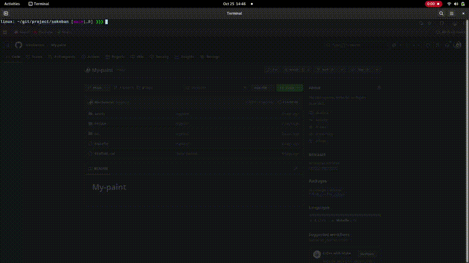

<h1 align="center">📦 Sokoban — Terminal Puzzle Game</h1>

<p align="center">
  <a href="#EN">🇬🇧 English</a> • <a href="#FR">🇫🇷 Français</a>
</p>

<p align="center">
  
  
  
  
</p>

---

### 🎬 Demo

<div align="center">
  
</div>

---


### 🗂️ Project Structure

```
.
├── assets/
├── include/
├── src/
└── maps/
```

---

### 🛠️ Build & Run

<p align="center">

| Step / Étape                                         | Command / Commande         | Description                                                                                                                 |
| ---------------------------------------------------- | -------------------------- | --------------------------------------------------------------------------------------------------------------------------- |
| 🔹 Compile the project / Compiler le projet          | <code>make</code>          | Compiles all sources and generates `sokoban` executable / Compile tous les fichiers source et génère l’exécutable `sokoban` |
| 🧹 Clean object files / Nettoyer les fichiers objets | <code>make clean</code>    | Removes temporary files (`*.o`) / Supprime les fichiers temporaires (`*.o`)                                                 |
| ❌ Remove everything / Supprimer tout                 | <code>make fclean</code>   | Removes object files and executable / Supprime les fichiers objets et l’exécutable                                          |
| 🔄 Recompile / Recompiler                            | <code>make re</code>       | Cleans then compiles again / Nettoie puis compile à nouveau le projet                                                       |
| ▶️ Run the game / Lancer le jeu                      | <code>./sokoban map</code> | Starts the Sokoban game using a map file / Lance le jeu Sokoban avec un fichier de carte                                    |

</p>

---

## 🇬🇧 English <a id="EN"></a>

### 🧠 Overview

**Sokoban** is a terminal-based puzzle game coded in **C** using the **ncurses** library.
The player must push boxes onto storage spots in a warehouse without getting stuck.

---

### 🎮 Gameplay

* Move the player using **arrow keys**.
* Push boxes (`X`) onto storage locations (`O`).
* Restart the level with **Space**.
* Quit the game with **A** or **Escape**.

Win by placing all boxes on storage locations.

---

### 🗺️ Map Format

| Character | Meaning          |
| --------- | ---------------- |
| `#`       | Wall             |
| `P`       | Player           |
| `X`       | Box              |
| `O`       | Storage location |
| Space     | Empty floor      |

**Example map:**

```
#########
#   O   #
#  XXX  #
#   P   #
#########
```

---

### ⚙️ Usage

```bash
./sokoban map
```

**Example:**

```bash
./sokoban maps/level1.txt
```

---

### ⬇️ Download (precompiled version)

<p align="center">
🔹 <strong>Latest ready-to-use version:</strong><br>
<a href="https://github.com/USERNAME/sokoban/releases/download/latest/sokoban">👉 Download Sokoban (latest release)</a><br>
<em>Precompiled binary — ready to play in your terminal!</em>
</p>

<p align="center">
Or clone the project:<br>
<code>git clone git@github.com:USERNAME/sokoban.git</code>
</p>

---

### ✨ Features

* Classic Sokoban mechanics
* ncurses-based terminal interface
* Fully customizable maps
* Quick restart and quit options
* Smooth and responsive keyboard controls

---

### 🧪 CI/CD Workflow

Each push on the `main` branch:

<p align="center">
🔨 Automatically compiles the project <br>
🚀 Publishes the binary to the “latest” release <br>
*(see <code>.github/workflows/build.yml</code>)*
</p>

---

## 🇫🇷 Français <a id="FR"></a>

### 🧠 Présentation

**Sokoban** est un jeu de **puzzle en terminal**, réalisé en **C** avec la bibliothèque **ncurses**.
Le joueur doit pousser des caisses jusqu’à leurs emplacements de stockage sans se bloquer.

---

### 🎮 Règles du jeu

* Déplacez le joueur avec les **flèches directionnelles**.
* Poussez les caisses (`X`) vers les zones de stockage (`O`).
* Redémarrez la partie avec **Espace**.
* Quittez le jeu avec **A** ou **Échap**.

La partie est gagnée lorsque toutes les caisses sont placées sur les emplacements de stockage !

---

### 🗺️ Format du fichier de carte

| Caractère | Signification    |
| --------- | ---------------- |
| `#`       | Mur              |
| `P`       | Joueur           |
| `X`       | Caisse           |
| `O`       | Zone de stockage |
| Espace    | Sol vide         |

**Exemple de carte :**

```
#########
#   O   #
#  XXX  #
#   P   #
#########
```

---

### ⚙️ Utilisation

```bash
./sokoban map
```

Exemple :

```bash
./sokoban maps/level1.txt
```

---

### ⬇️ Téléchargement (version compilée)

<p align="center">
🔹 <strong>Dernière version prête à l’emploi :</strong><br>
<a href="https://github.com/USERNAME/sokoban/releases/download/latest/sokoban">👉 Télécharger Sokoban (release latest)</a><br>
<em>Exécutable déjà compilé — prêt à jouer dans votre terminal !</em>
</p>

<p align="center">
Ou cloner le dépôt :<br>
<code>git clone git@github.com:USERNAME/sokoban.git</code>
</p>

---

### ✨ Fonctionnalités

* Mécaniques classiques du Sokoban
* Interface terminale avec ncurses
* Fichiers de cartes personnalisables
* Redémarrage et sortie rapides
* Contrôles simples et intuitifs

---

### 🧪 Workflow CI/CD

Chaque push sur la branche <code>main</code> :

<p align="center">
🔨 Compile automatiquement le projet <br>
🚀 Publie le binaire dans la release “latest” <br>
🧩 Défini dans <code>.github/workflows/build.yml</code>
</p>
